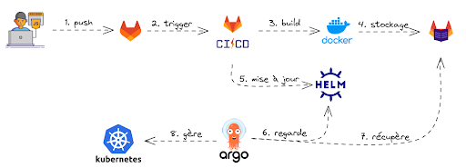

# JPO DO
## Description
Ce dépôt Gitlab contient un projet React + Vite réalisé par Baptiste BRONSIN pour la journée portes ouvertes de la formation DevOps de Polytech Montpellier. Le principe de ce projet est de réaliser une activité ludique de développement web et de montrer un fonctionnement de déploiement continu.

## Activité
Chaque participants ajoutera au code une nouvelle instance du composant `<Card />` avec les propriétées suivantes :
- `firstName`: Une String correspondant au prénom
- `characterId`: Un Interger correspondant à l'identifiant du personnage de la série Rick et Morty.

Ce projet utilise l'API de Rick et Morty : https://rickandmortyapi.com

## Architecture CI/CD

1. L'utilisateur réalise une modification et l'envoie sur la branche `main` du dépôt.
2. Gitlab s'apperçoit qu'une modification a été envoyée sur `main` et va donc activer sa pipeline.
3. La première étape de sa pipeline est de créer un artéfacte (une image Docker).
4. Une fois celui-ci généré, il va être stocké dans le registre de conteneurs de Gitlab.
5. Modifier le fichier de configuration helm pour utiliser notre nouvelle image Docker.
6. Par défaut, notre opérateur ArgoCD regarde toutes les 5 minutes notre dépôt si le fichier de configuration helm a été mis à jour.
7. Si c'est le cas, alors il récupère l'image Docker (artéfacte) depuis le registre de Gitlab.
8. ArgoCD met à jour les déploiements dans le cluster Kubernetes.

Et voilà !

## Point supplémentaire: Utilisation de deux branches
Ici nous utilisons deux branches: `main` et `main-infra`.

La branche `main` est utilisée pour mettre à jour l'application.
Tandis que la branche `main-infra` est dédiée à la mise à jour du fichier `values.yaml` et c'est cette même branche que ArgoCD regarde toutes les 5 minutes.